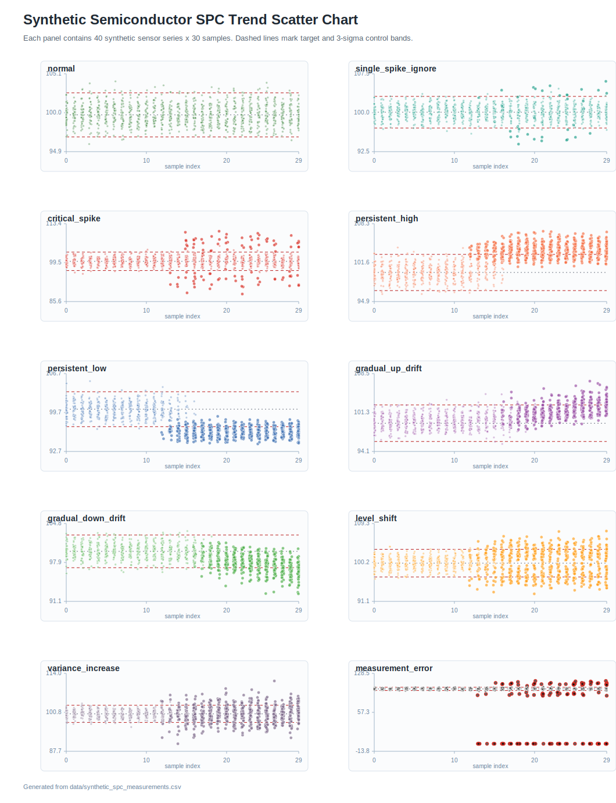

# Semiconductor SPC Trend Detection Synthetic Data

반도체 공정 계측/센서 트렌드 감지 실험을 위한 가상 SPC 데이터셋입니다. 사내 생산 데이터를 외부로 가져오지 않고도 룰 기반 탐지, 특징량 설계, 분류 모델 학습, 시각화 검증을 진행할 수 있도록 10개 유형의 시계열 패턴을 생성합니다.

## 생성 가정

- 하나의 `series_id`는 lot/wafer/equipment/sensor 조합 하나의 시계열입니다.
- 각 시계열은 30개의 순차 샘플을 가집니다.
- 유형별 40개 시계열을 생성해 총 400개 시계열, 12,000개 측정 포인트를 제공합니다.
- 측정값은 100 근처의 정규화된 센서 값이며, 시계열마다 `target`과 `sigma`가 조금씩 다릅니다.
- 관리 한계는 `target +/- 3 sigma`, critical 한계는 `target +/- 5 sigma`로 계산했습니다.

## 파일 구성

| Path | 설명 |
| --- | --- |
| `scripts/generate_synthetic_spc_data.py` | 가상 데이터와 scatter chart를 재현 생성하는 스크립트입니다. Python 표준 라이브러리만 사용합니다. |
| `data/synthetic_spc_measurements.csv` | 포인트 단위 센서 측정 데이터입니다. |
| `data/synthetic_series_metadata.csv` | 시계열 단위 장비, 공정, 센서, target, sigma, anomaly start 정보입니다. |
| `data/anomaly_type_summary.csv` | 유형별 값 분포와 이상 포인트 수 요약입니다. |
| `assets/spc_trend_scatter.svg` | 전체 유형을 faceted scatter chart로 시각화한 파일입니다. |
| `agent.md` | 이 프로젝트 진행 시 참고할 코딩 프로세스 가이드입니다. |

## 트렌드 유형

| Type | 합성 패턴 설명 |
| --- | --- |
| `normal` | Target 주변의 정상 공정 노이즈입니다. |
| `single_spike_ignore` | 한 번 튀지만 바로 정상 범위로 복귀하는 isolated spike입니다. |
| `critical_spike` | Critical 한계를 넘는 큰 spike가 여러 번 발생합니다. |
| `persistent_high` | anomaly start 이후 높은 값이 지속됩니다. |
| `persistent_low` | anomaly start 이후 낮은 값이 지속됩니다. |
| `gradual_up_drift` | anomaly start 이후 서서히 상승 drift가 진행됩니다. |
| `gradual_down_drift` | anomaly start 이후 서서히 하락 drift가 진행됩니다. |
| `level_shift` | anomaly start 이후 baseline이 위 또는 아래로 급격히 이동합니다. |
| `variance_increase` | 평균은 비슷하지만 anomaly start 이후 분산이 커집니다. |
| `measurement_error` | sensor dropout, out-of-range 같은 측정 오류 raw reading을 포함합니다. |

## 데이터 분포

초기 탐지 로직과 분류 모델을 비교하기 쉽도록 유형별 class count는 균형 있게 맞췄습니다.

| Trend type | Series count | Point count |
| --- | ---: | ---: |
| `normal` | 40 | 1,200 |
| `single_spike_ignore` | 40 | 1,200 |
| `critical_spike` | 40 | 1,200 |
| `persistent_high` | 40 | 1,200 |
| `persistent_low` | 40 | 1,200 |
| `gradual_up_drift` | 40 | 1,200 |
| `gradual_down_drift` | 40 | 1,200 |
| `level_shift` | 40 | 1,200 |
| `variance_increase` | 40 | 1,200 |
| `measurement_error` | 40 | 1,200 |

### 값 분포 요약

| Trend type | Mean | Std | Min | Max | Anomalous points | Invalid readings |
| --- | ---: | ---: | ---: | ---: | ---: | ---: |
| `normal` | 99.785 | 1.339 | 95.881 | 104.134 | 0 | 0 |
| `single_spike_ignore` | 100.068 | 1.453 | 93.935 | 106.002 | 40 | 0 |
| `critical_spike` | 100.016 | 2.373 | 88.324 | 110.724 | 98 | 0 |
| `persistent_high` | 101.887 | 2.271 | 96.233 | 107.021 | 614 | 0 |
| `persistent_low` | 98.172 | 2.233 | 94.026 | 105.313 | 633 | 0 |
| `gradual_up_drift` | 100.555 | 1.768 | 95.529 | 107.125 | 471 | 0 |
| `gradual_down_drift` | 99.041 | 1.773 | 92.411 | 103.474 | 458 | 0 |
| `level_shift` | 100.097 | 2.472 | 92.878 | 107.559 | 609 | 0 |
| `variance_increase` | 100.254 | 2.288 | 90.221 | 111.468 | 628 | 0 |
| `measurement_error` | 95.600 | 21.319 | 0.000 | 114.688 | 123 | 123 |

## Scatter Chart

아래 차트는 모든 측정 포인트를 `sample_index`와 `value` 기준으로 그린 scatter chart입니다. 패널은 트렌드 유형별로 분리되어 있으며, 이상 구간 포인트는 조금 더 크게 표시하고 `measurement_error`의 invalid reading은 빨간 테두리로 표시했습니다.



## Measurement CSV Schema

| Column | 설명 |
| --- | --- |
| `series_id` | 가상 시계열 고유 ID입니다. |
| `trend_type` | 10개 트렌드 유형 중 하나입니다. |
| `sample_index` | 0부터 29까지의 순차 샘플 위치입니다. |
| `sampled_at` | 가상 측정 timestamp입니다. |
| `lot_id`, `wafer_id`, `equipment_id` | 가상 제조 맥락 정보입니다. |
| `process_step`, `sensor_name` | 가상 반도체 공정과 센서 종류입니다. |
| `target`, `sigma` | 시계열 단위 SPC 중심값과 노이즈 규모입니다. |
| `lcl`, `ucl` | 3-sigma 관리 한계입니다. |
| `critical_low`, `critical_high` | 5-sigma critical 한계입니다. |
| `value` | 가상 raw sensor value입니다. |
| `point_label` | `baseline`, `critical_spike`, `sensor_dropout` 같은 포인트 단위 라벨입니다. |
| `is_anomalous_point` | 주입한 트렌드/이상 구간에 속하는 포인트인지 나타냅니다. |
| `is_valid_reading` | raw reading이 유효한지 나타냅니다. 측정 오류 유형의 invalid row는 `false`입니다. |

## 재생성

```bash
python3 scripts/generate_synthetic_spc_data.py
```

생성기는 고정 seed (`20260525`)를 사용하므로 다시 실행해도 같은 데이터셋과 차트가 생성됩니다.
