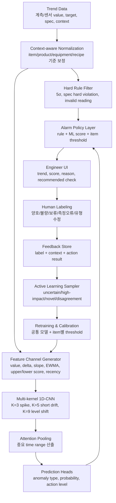
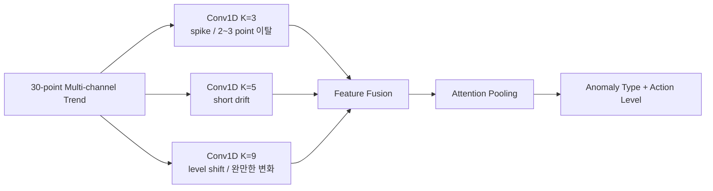
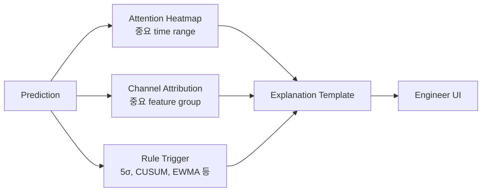
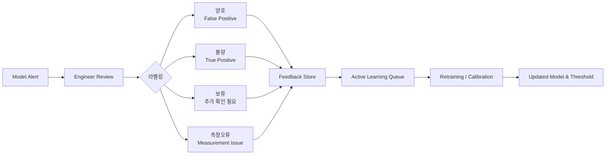
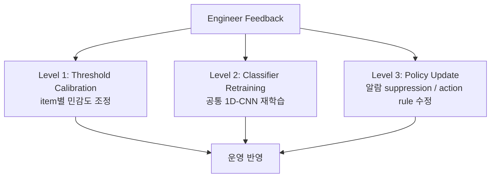
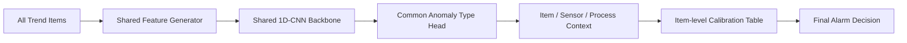
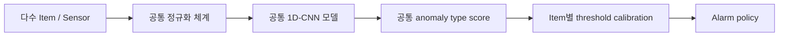
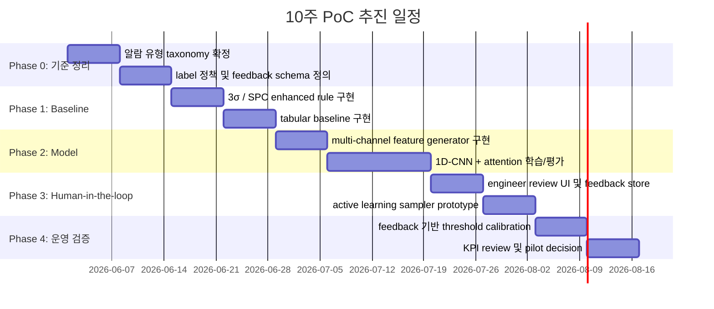

# 반도체 공정 Trend 이상 감지 고도화 제안서

> 목적: 기존 3σ 단일 기준 기반 모니터링을 **Action-worthy Trend Detection 체계**로 전환하여, 엔지니어 알람 피로도를 줄이고 공정 이상 대응의 일관성, 설명 가능성, 지속 학습 가능성을 높인다.

---

## 1. Executive Summary

### 결론

현행 3σ 기반 알람은 단일 포인트 이탈에는 반응하지만, 실제 엔지니어 판정 기준인 **연속 이탈, 점진 drift, level shift, 상/하한 비대칭, 측정 오류 구분**을 충분히 반영하지 못한다.  
따라서 본 제안은 단순 딥러닝 도입이 아니라, 아래와 같은 **Human-in-the-loop 기반 하이브리드 지능형 모니터링 체계**로 전환하는 것을 목표로 한다.

```mermaid
flowchart LR
    A["Raw 계측/센서 Trend"] --> B["Robust Normalization"]
    B --> C["SPC Rule Layer"]
    C --> D["Feature Channel 생성"]
    D --> E["Multi-kernel 1D-CNN"]
    E --> F["Attention Pooling"]
    F --> G["Anomaly Type / Score / Action Level"]
    G --> H["Explanation Module"]
    H --> I["Engineer Labeling\n양호/불량/보류/측정오류"]
    I --> J["Feedback Store"]
    J --> K["Active Learning\n재학습 후보 선정"]
    K --> L["Model & Threshold Calibration"]
    L --> D
```



### 핵심 제안

| 구분 | 기존 방식 | 제안 방식 |
|---|---|---|
| 판단 기준 | target ± 3σ 중심 | SPC rule + 1D-CNN 기반 trend pattern 판단 |
| 감지 대상 | 단일 포인트 이탈 | spike, persistent high/low, drift, level shift, variance 증가, measurement error |
| 상/하한 차이 | 동일 기준 적용 | upper/lower score를 분리하여 비대칭 관리 |
| 설명 가능성 | 알람 발생 여부 중심 | 중요 시점, 중요 feature group, 이상 유형, 권장 확인 항목 제공 |
| 운영 방식 | 엔지니어 수동 확인 중심 | 알람 우선순위화 + feedback learning |
| 학습 방식 | 초기 rule 고정 | 엔지니어 피드백을 이용한 active learning 및 주기적 calibration |
| 확장 전략 | item별 rule 수작업 관리 | 공통 모델 backbone + item별 threshold/calibration |

### 기대 효과

| 기대 효과 | PoC 검증 목표 |
|---|---:|
| 불필요 알람 감소 | 기존 3σ 대비 false positive 40~60% 감소 |
| Critical miss 방지 | 기존 rule 대비 critical miss 동등 이하 유지 |
| 대응 우선순위화 | action-worthy alert precision 2배 개선 목표 |
| 판정 기준 표준화 | 엔지니어별 눈높이 차이를 label/rule/threshold로 구조화 |
| 지속 개선 체계 확보 | 엔지니어 피드백이 모델/threshold 개선으로 연결 |
| 확장성 확보 | item별 개별 모델이 아닌 공통 모델 + item별 calibration 체계 |

---

## 2. 문제 정의: 왜 3σ 방식만으로는 부족한가

### 현재 Pain Point

- 관리 대상 item 수 증가로 엔지니어 육안 판정 부담 증가
- 3σ 단일 기준 적용 후에도 false positive가 많아 알람 피로도 지속
- 실제 엔지니어 판정 기준은 단일 포인트 이탈보다 복합적임
  - 한 포인트 spike는 생산성 관점에서 무시하는 경우 존재
  - 2~3포인트 이상 연속 이탈 시에만 조치하는 경우 존재
  - 점진적 상승/하락 drift가 중요할 수 있음
  - 상한 방향과 하한 방향의 위험도가 다른 item 존재
  - 측정 오류와 실제 공정 이상을 구분해야 함
- 모델 도입 이후에도 엔지니어가 “왜 알람이 났는지” 납득하지 못하면 운영 수용성이 낮아질 수 있음
- 관리 item별로 모델을 따로 만들 경우 모델 수, label 수, 재학습 주기, version 관리가 폭증할 수 있음

### 핵심 진단

> 현재 문제의 본질은 “3σ threshold가 낮다/높다”가 아니라, **엔지니어의 암묵적 trend 판정 기준이 시스템에 구조화되어 있지 않고, 현업 피드백이 모델 개선으로 연결되는 폐루프가 없다는 점**이다.

---

## 3. 학술적·기술적 근거

### 3.1 SPC 관점: Shewhart 3σ는 큰 이탈에는 강하지만 작은 drift에는 약하다

- NIST/Sematech Engineering Statistics Handbook은 Shewhart 방식이 최신 측정값과 control limit 이탈 여부에 크게 의존한다고 설명한다.
- 같은 문헌에서 EWMA는 과거 데이터를 지수 가중 평균하여 **small or gradual drift**에 민감하게 설계할 수 있다고 설명한다.
- CUSUM chart는 평균의 작은 shift, 특히 2σ 이하 shift를 감지할 때 Shewhart 방식보다 효율적이라고 설명된다.

**시사점:** 3σ rule을 폐기하기보다는, hard rule로 유지하되 EWMA/CUSUM/연속 이탈 rule을 feature 또는 rule layer로 반영해야 한다.

### 3.2 Time-series Deep Learning 관점: 1D Convolution은 trend shape 감지에 적합하다

- InceptionTime 연구는 time-series classification에서 convolution 기반 deep architecture가 높은 정확도와 확장성을 동시에 달성할 수 있음을 보였다.
- MiniROCKET 연구는 random convolutional kernels 기반 time-series transform이 높은 정확도 대비 계산 비용을 크게 낮출 수 있음을 보였다.

**시사점:** 최근 30포인트 trend처럼 짧은 sequence에서는 RNN보다 1D-CNN 또는 convolutional time-series classifier가 더 단순하고 운영 친화적일 가능성이 높다.

### 3.3 Explainability 관점: Attention은 설명 단서이지 원인 자체는 아니다

- Attention mechanism은 입력의 어느 구간을 많이 참고했는지 보여줄 수 있다.
- 하지만 “Attention is not Explanation” 계열 연구는 attention weight만으로 모델 판단의 완전한 원인 설명이라고 보기 어렵다고 지적한다.

**시사점:** Attention heatmap은 엔지니어 설명 UI에 유용하지만, channel-wise occlusion, time-wise occlusion, rule trigger를 함께 제공해야 한다.

### 3.4 Active Learning 관점: 모든 데이터를 라벨링하기보다 정보량이 큰 샘플을 우선 라벨링한다

- Active learning은 모델이 불확실하거나, 기존 학습 데이터와 다르거나, 운영상 영향도가 큰 샘플을 우선적으로 전문가에게 질의하여 라벨 효율을 높이는 접근이다.
- 반도체 공정 이상은 rare event이고, 엔지니어 라벨링 시간은 제한적이므로 전체 알람을 동일하게 검수하는 방식은 비효율적이다.

**시사점:** 모델이 판정한 전체 알람을 모두 재학습에 사용하는 것이 아니라, **불확실성, 영향도, 신규 패턴, 엔지니어 disagreement**가 큰 샘플을 선별하여 active learning queue로 관리해야 한다.

---

## 4. 제안 Architecture

### 4.1 전체 구조



### 4.2 Feature Channel 설계

1D-CNN 입력은 단순 raw sequence가 아니라, 엔지니어가 trend를 볼 때 사용하는 관점을 channel로 구조화한 형태이다.

```text
Input shape = [time=30, channels=8~10]
```

| Channel | 의미 | 기대 역할 |
|---|---|---|
| `value_norm` | target 대비 robust normalized value | 기본 level 판단 |
| `delta` | 직전 point 대비 변화량 | spike, jump 감지 |
| `rolling_slope` | 최근 k개 point 기울기 | gradual up/down drift 감지 |
| `ewma` | 지수 가중 이동 평균 | 완만한 평균 이동 감지 |
| `upper_score` | 상한 방향 위험도 | 상한 비대칭 관리 |
| `lower_score` | 하한 방향 위험도 | 하한 비대칭 관리 |
| `position` | window 내 절대 위치 | 오래된 이상과 최근 이상 구분 |
| `recency` | 최근성 가중 | 현재 action 필요성 반영 |
| `missing_flag` | 결측/invalid 여부 | 측정 오류 분리 |
| `time_gap` | sampling gap | irregular sampling 보정 |

### 4.3 Multi-kernel 1D-CNN의 역할



**왜 RNN보다 우선 검토하는가?**

- window length가 30으로 짧아 long-term memory보다 local pattern 감지가 중요함
- convolution은 병렬 계산이 가능해 item 수가 많을 때 운영 비용이 낮음
- kernel size별로 spike, drift, level shift를 분리 학습할 수 있음
- feature channel과 결합하면 엔지니어 설명 가능성이 RNN보다 직관적임

---

## 5. 이상 유형 Taxonomy

단순 정상/이상 binary label은 현장 판단을 과도하게 단순화한다. 아래와 같이 anomaly type을 분리해야 false positive를 줄이고 action 우선순위를 정할 수 있다.

| Type | 설명 | Action Policy |
|---|---|---|
| `normal` | target 주변 정상 노이즈 | no alarm |
| `single_spike_ignore` | 단발성 spike 후 정상 복귀 | suppress 또는 low priority |
| `critical_spike` | 5σ 또는 hard spec 초과 | immediate alarm |
| `persistent_high` | 상한 방향 연속 이탈 | alarm |
| `persistent_low` | 하한 방향 연속 이탈 | alarm |
| `gradual_up_drift` | 점진 상승 drift | warning 또는 monitoring 강화 |
| `gradual_down_drift` | 점진 하락 drift | warning 또는 monitoring 강화 |
| `level_shift` | baseline 급격 이동 | alarm |
| `variance_increase` | 산포 증가 | warning |
| `measurement_error` | sensor dropout/out-of-range | 공정 이상과 분리, measurement check |

현재 repository의 synthetic dataset은 위 10개 유형을 기준으로 구성되어 있으며, 각 유형별 40개 series, 총 400개 series/12,000개 point를 제공한다.


---

## 6. 설명 가능성: 엔지니어가 납득할 수 있는 알람으로 전환

### 6.1 모델 설명의 목표

모델의 목표는 “AI가 이상이라고 했다”가 아니라, 엔지니어가 다음 질문에 답할 수 있게 만드는 것이다.

1. 어느 시점 때문에 알람이 발생했는가?
2. 어떤 trend 관점이 중요했는가?
3. 단발 spike인지, drift인지, persistent 이탈인지?
4. 지금 action이 필요한가, monitoring만 하면 되는가?
5. 측정 오류 가능성은 없는가?

### 6.2 Explanation Payload



### 6.3 설명 예시

> 판정: `gradual_up_drift` / Action Level: Warning  
> 주요 근거: 최근 5포인트에서 `rolling_slope`, `EWMA`, `upper_score`가 동시에 증가했습니다.  
> 중요 구간: t26~t30  
> 해석: 단발 spike보다는 상한 방향 drift가 진행 중인 패턴입니다. 동일 설비/recipe의 최근 PM 및 neighbor wafer trend 확인을 권장합니다.

---

## 7. Human-in-the-loop Active Learning 운영 설계

### 7.1 왜 Human-in-the-loop가 필요한가

반도체 공정 trend 이상은 일반 이미지 분류처럼 정답이 항상 명확하지 않다. 동일한 trend라도 생산성, 공정 step, 설비 이력, recipe 변경, 최근 event에 따라 엔지니어 판단이 달라질 수 있다. 따라서 모델은 초기에 완성되는 것이 아니라, **현업 판단을 지속적으로 흡수하면서 운영 기준에 맞게 수렴**해야 한다.



### 7.2 엔지니어 라벨링 항목

알람 발생 후 엔지니어가 단순히 양호/불량만 입력하면 정보량이 부족하다. 최소 라벨과 선택 라벨을 나누어 운영한다.

| 구분 | 라벨 항목 | 목적 |
|---|---|---|
| 필수 | `review_result`: 양호 / 불량 / 보류 / 측정오류 | 모델 판정의 정오답 판단 |
| 필수 | `action_required`: Yes / No | action-worthy alert 학습 |
| 선택 | `correct_anomaly_type` | 모델이 유형을 잘못 분류한 경우 보정 |
| 선택 | `root_cause_hint` | 설비, recipe, PM, 계측 오류 등 원인 후보 기록 |
| 선택 | `severity` | Warning / Alarm / Critical |
| 선택 | `comment` | 엔지니어 판단 근거 축적 |

### 7.3 Active Learning 대상 선정 기준

모든 알람을 동일하게 라벨링하면 엔지니어 부담이 다시 커진다. 따라서 active learning queue는 아래 기준으로 선별한다.

| 선정 기준 | 예시 | 기대 효과 |
|---|---|---|
| Uncertainty sampling | anomaly probability가 0.45~0.55 근처 | 모델 경계면 개선 |
| High-impact sampling | critical item, 주요 공정 step, high-volume product | 리스크 큰 영역 우선 개선 |
| Novel pattern sampling | 기존 type과 embedding 거리가 큰 trend | 신규 이상 패턴 조기 포착 |
| Disagreement sampling | SPC rule과 ML 판정이 충돌 | rule/model 조합 개선 |
| Repeated FP sampling | 같은 item에서 반복 reject 발생 | item별 threshold calibration |
| Rare class sampling | measurement_error, variance_increase 부족 | class imbalance 완화 |

### 7.4 Feedback이 모델에 반영되는 방식

엔지니어 피드백은 세 가지 수준으로 반영한다.



| 반영 수준 | 주기 | 설명 |
|---|---|---|
| Level 1. Threshold calibration | 주간 또는 상시 | item별 false positive가 많은 경우 threshold, persistence rule 조정 |
| Level 2. Model retraining | 월간 또는 분기 | 누적 라벨로 공통 1D-CNN/분류 head 재학습 |
| Level 3. Alarm policy update | 필요 시 | suppress 조건, critical rule, duplicate grouping 정책 수정 |

### 7.5 운영상 주의점: item별 모델 난립 방지

Human-in-the-loop을 도입하면 item별 feedback이 쌓이기 때문에 “각 trend item마다 별도 모델을 만들어야 하는가?”라는 운영 이슈가 발생한다. 그러나 item별 모델을 무분별하게 만들면 아래 문제가 생긴다.

| 리스크 | 내용 |
|---|---|
| 모델 수 폭증 | item 수만큼 모델, 성능 리포트, 재학습 pipeline 필요 |
| label 부족 | 개별 item 단위로는 불량 label이 희소하여 과적합 위험 증가 |
| version 관리 복잡도 | item별 모델 version, 배포, rollback 관리 필요 |
| cold-start 문제 | 신규 item은 라벨이 없어 모델 생성 불가 |
| 기준 불일치 | item별 모델이 서로 다른 판정 기준을 학습할 수 있음 |

따라서 운영 원칙은 다음과 같이 가져간다.

> **모델은 공통 backbone을 유지하고, item별 차이는 normalization, context feature, threshold calibration으로 흡수한다.**



### 7.6 모델 운영 정책

| 구분 | 기본 정책 | 예외 정책 |
|---|---|---|
| 일반 item | 공통 모델 + item별 threshold | 별도 모델 금지 |
| 고위험 critical item | 공통 모델 + 강화된 hard rule | 충분한 label 확보 시 specialist head 검토 |
| 신규 item | target/sigma/spec 기반 cold-start | 초기에는 보수적 threshold 적용 |
| 반복 false positive item | threshold/persistence/suppression 조정 | 필요 시 feature scaling 점검 |
| 신규 anomaly pattern | active learning queue 등록 | taxonomy 확장 여부 review |

---

## 8. 운영 설계: 공통 모델 + item별 calibration

관리 item마다 단위, target, sigma, 상/하한 중요도가 다르기 때문에 item별 개별 모델을 만드는 방식은 장기 운영에 부적합하다. 대신 아래 구조를 제안한다.



### 장점

- item이 늘어나도 모델 수가 선형적으로 증가하지 않음
- 신규 item은 target/sigma/spec만 있으면 cold-start 가능
- item별 민감도는 threshold와 calibration table로 관리 가능
- 공통 anomaly taxonomy를 통해 엔지니어 간 판정 기준 표준화 가능
- Human-in-the-loop feedback은 개별 모델 양산이 아니라, 공통 모델 개선과 item별 calibration 개선에 우선 사용 가능

---

## 9. PoC 설계

### 9.1 비교 대상

| 실험군 | 방식 | 목적 |
|---|---|---|
| A | 현행 3σ rule | baseline |
| B | SPC enhanced rule | 연속 이탈, EWMA, CUSUM 추가 효과 확인 |
| C | Tabular model | window summary feature + CatBoost/LightGBM |
| D | Raw 1D-CNN | sequence shape 학습력 확인 |
| E | Multi-channel 1D-CNN | feature channel 효과 확인 |
| F | Multi-channel 1D-CNN + Attention | 설명 가능성과 최근성 반영 효과 확인 |
| G | F + Human feedback calibration | 엔지니어 label 기반 FP 감소 효과 확인 |
| H | F + Active learning loop | 제한된 label budget에서 성능 개선 속도 확인 |

### 9.2 핵심 KPI

| KPI | 정의 | 목표 |
|---|---|---:|
| False positive / item / week | 엔지니어 reject 알람 수 | 기존 대비 40~60% 감소 |
| Action-worthy precision | 엔지니어 accept 알람 비율 | 기존 대비 2배 개선 |
| Critical miss count | critical event 미검출 수 | 기존 rule 이하 유지 |
| Detection delay | 이상 시작 후 알람까지 point 수 | drift 유형에서 단축 |
| Duplicate suppression rate | 동일 root-cause 중복 알람 묶기 | 운영 정책 수립 |
| Explanation acceptance | 설명이 판단에 도움된 비율 | pilot engineer feedback으로 측정 |
| Label efficiency | 동일 라벨링 시간 대비 성능 개선량 | active learning 효과 측정 |
| Calibration gain | feedback 반영 후 FP 감소량 | item별 threshold 보정 효과 측정 |

### 9.3 PoC Roadmap



---

## 10. 리스크와 대응 방안

| 리스크 | 내용 | 대응 방안 |
|---|---|---|
| Label inconsistency | 엔지니어별 판정 기준 차이 | taxonomy 기반 label guide, disagreement review |
| Feedback bias | 일부 엔지니어/일부 item feedback만 과대표집 | reviewer group 운영, sampling quota 관리 |
| False negative | critical event 미검출 | hard rule layer 유지, critical class 가중치 부여 |
| False positive 재발 | 모델 score만으로 알람 시 피로도 지속 | item별 threshold, suppression, action policy layer 적용 |
| Item별 모델 난립 | trend item마다 별도 모델 관리 필요 발생 | 공통 backbone + item별 calibration 원칙 유지 |
| Attention 오해 | attention을 원인으로 과해석 | occlusion/gradient/rule trigger와 함께 설명 |
| Data leakage | 동일 series/window가 train-test에 중복 | series/time/product/equipment 기준 split 엄격 적용 |
| Drift over time | 공정 조건 변경으로 모델 성능 저하 | feedback loop, monthly calibration, champion-challenger 운영 |
| 운영 복잡도 | feature/version/model 관리 필요 | feature store schema와 model card 관리 |

---

## 11. 의사결정 요청 사항

### 요청 1. PoC 추진 승인

- 범위: synthetic data + 제한된 실제 비식별 trend sample 기반 검증
- 기간: 10주
- 산출물: baseline 비교 리포트, 모델 prototype, explanation UI mock, feedback schema, active learning prototype, KPI review

### 요청 2. 현업 label review 리소스 확보

- 최소 2~3명의 experienced engineer가 주 1회 label disagreement review 참여
- accept/reject/defer/measurement issue feedback을 표준화
- Active learning queue에서 선별된 알람을 우선 review하여 라벨 효율을 높임

### 요청 3. Pilot 적용 기준 합의

Pilot 전환 기준은 모델 정확도가 아니라 아래 운영 KPI로 판단한다.

```text
1. 기존 3σ 대비 false positive 40% 이상 감소
2. critical miss count 기존 rule 이하 유지
3. engineer accept rate 유의미 개선
4. alarm explanation이 현업 판단에 도움된다는 feedback 확보
5. feedback 반영 후 item별 calibration 개선 효과 확인
```

### 요청 4. 운영 원칙 합의

```text
1. item별 개별 모델 양산은 기본적으로 금지
2. 공통 backbone + item별 threshold/calibration을 기본 운영 단위로 채택
3. critical item에 한해 충분한 label이 확보된 경우 specialist head를 예외 검토
4. Human feedback은 모델 재학습뿐 아니라 threshold, suppression rule, taxonomy 개선에 함께 사용
```

---

## 12. 최종 메시지

본 과제는 단순히 RNN 또는 CNN을 도입하는 모델링 과제가 아니다.  
핵심은 엔지니어가 눈으로 보던 trend 판정 기준을 **feature channel, SPC rule, anomaly taxonomy, feedback learning**으로 구조화하는 것이다.

> 제안 방향은 “AI가 알람을 대신 내는 시스템”이 아니라,  
> **불필요 알람은 줄이고, 조치 가능한 이상은 설명과 함께 우선순위화하며, 엔지니어 피드백으로 지속 개선되는 공정 모니터링 의사결정 시스템**이다.

---

## References

1. NIST/Sematech Engineering Statistics Handbook, [EWMA Control Charts](https://www.itl.nist.gov/div898/handbook/pmc/section3/pmc314.htm): EWMA는 과거 관측값을 지수 가중 평균하여 small/gradual drift에 민감하게 설계 가능.
2. NIST/Sematech Engineering Statistics Handbook, [CUSUM Control Charts](https://www.itl.nist.gov/div898/handbook/pmc/section3/pmc313.htm): CUSUM은 process mean의 작은 shift, 특히 2σ 이하 shift 감지에 효율적.
3. Ismail Fawaz et al. (2019), [InceptionTime: Finding AlexNet for Time Series Classification](https://arxiv.org/abs/1909.04939): convolution 기반 time-series classification architecture의 정확도와 확장성 근거.
4. Dempster et al. (2020), [MINIROCKET: A Very Fast Almost Deterministic Transform for Time Series Classification](https://arxiv.org/abs/2012.08791): convolutional kernel 기반 time-series transform의 계산 효율성 근거.
5. Jain & Wallace (2019), [Attention is not Explanation](https://arxiv.org/abs/1902.10186): attention weight를 단독 설명 근거로 과신하면 안 된다는 해석 리스크 근거.
6. Settles (2009), [Active Learning Literature Survey](https://burrsettles.com/pub/settles.activelearning.pdf): 전문가 라벨링 비용이 높은 환경에서 informative sample을 선별해 학습 효율을 높이는 active learning 개념 근거.
