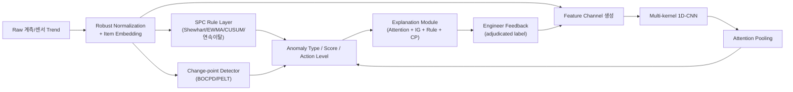
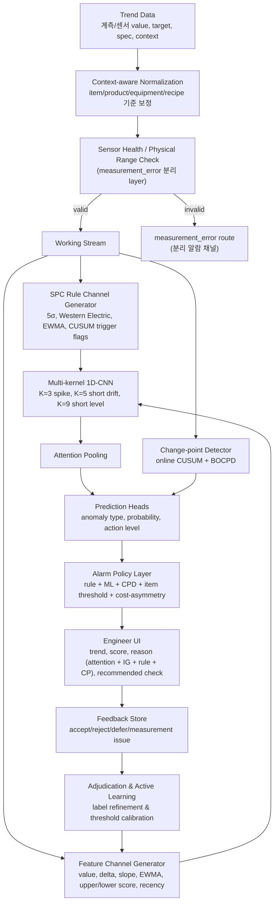
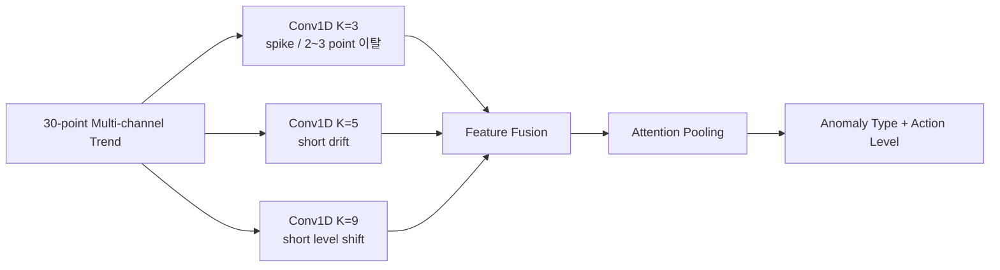
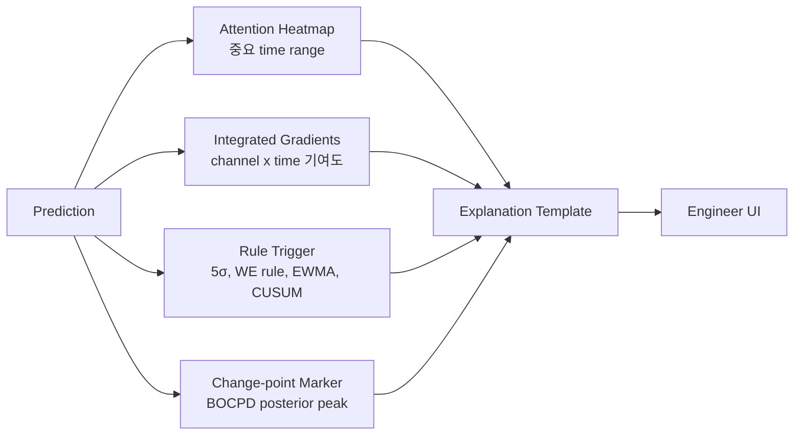
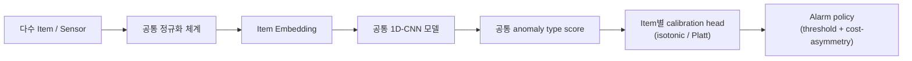
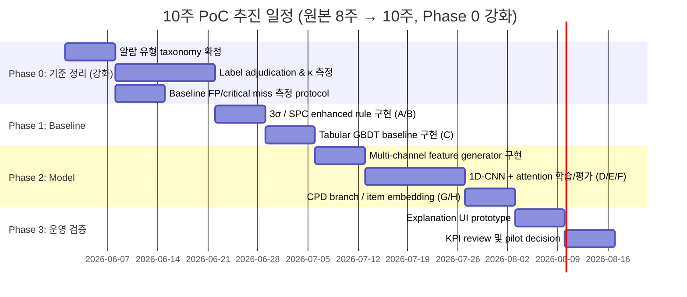

# 반도체 공정 Trend 이상 감지 고도화 제안서 (Claude Review v1)

> **본 문서는 원본 `presentation.md`에 대한 논리적·학술적 검토를 반영한 보강판이다.**
> 원본의 방향성(SPC rule + multi-channel 1D-CNN + attention pooling + feedback loop)은 유지하되,
> 임원 보고 전 반드시 정리되어야 할 가정·한계·평가 방법론·label 신뢰성 항목을 추가하였다.

---

## 0. 원본 대비 보완 요지 (Reviewer Summary)

| # | 원본의 약점 | 보완 방향 |
|---|---|---|
| 1 | "엔지니어 기준 비일관성"을 문제로 정의하면서, 동일 엔지니어 label로 모델을 학습 (순환 논리) | **Label adjudication protocol + inter-annotator agreement(κ) 측정**을 PoC Phase 0에 명시 |
| 2 | Synthetic dataset 결과를 임원 보고용으로 일반화 | Synthetic은 **algorithmic sanity check 용도**로 한정, 실데이터 transfer 단계를 PoC에 분리 |
| 3 | Window=30 + 1D-CNN으로 level shift / long drift 까지 처리 주장 | **Change-point detection(CUSUM/BOCPD) branch 추가** — hybrid 구조로 정직하게 표기 |
| 4 | CNN의 marginal lift 가설 부재 (이미 EWMA/slope/upper-lower score를 channel에 넣음) | **Tabular GBDT baseline(C)** 대비 CNN(E,F)이 추가로 잡는 패턴 가설을 명시 (waveform shape, multi-channel co-occurrence) |
| 5 | Hard rule pre-filter ↔ 모델 학습 간 sampling bias 미고려 | Rule trigger를 **filter가 아니라 channel + auxiliary label**로 모델에 함께 입력 |
| 6 | Measurement error를 CNN class 중 하나로 분류 | Sensor health / physical-range / redundancy 기반 **별도 rule layer**로 분리 |
| 7 | Class imbalance 대응 누락 (normal 압도적, critical 희소) | Focal loss / class-balanced sampling / cost-sensitive thresholding 명시 |
| 8 | 평가 metric을 point-wise F1으로 암묵 가정 | **Event-based F1, range-based F1 (Tatbul et al. 2018), detection delay distribution** 명시 |
| 9 | KPI 목표치(FP 40-60% 감소 등)의 baseline 측정 방법 부재 | PoC Phase 0에 **현행 FP/critical miss 측정 protocol**을 정의하고 합의 |
| 10 | Attention 외 설명 도구가 "있다" 수준 | Integrated Gradients / time-series SHAP 등 **post-hoc XAI를 구체적으로 명시** |
| 11 | "공통 모델" 주장이 강함 (item별 물리 단위 상이) | **Item embedding + per-item calibration head** 구조로 보완 |
| 12 | Concept drift / retraining cadence 모호 | Monthly champion-challenger + drift detector(PSI/ADWIN) 명시 |

---

## 1. Executive Summary

### 결론

현행 3σ 기반 알람은 단일 포인트 이탈에는 반응하지만, 실제 엔지니어 판정 기준인 **연속 이탈, 점진 drift, level shift, 상/하한 비대칭, 측정 오류 구분**을 충분히 반영하지 못한다.
따라서 본 제안은 단순 딥러닝 도입이 아니라, 아래와 같은 **하이브리드 지능형 모니터링 체계**로 전환하는 것을 목표로 한다.



> **원본 대비 추가 요소**: Item embedding, Change-point detector branch, Explanation module에 Integrated Gradients/Rule trigger 명시.

### 핵심 제안

| 구분 | 기존 방식 | 제안 방식 |
|---|---|---|
| 판단 기준 | target ± 3σ 중심 | SPC rule + 1D-CNN + Change-point detector 기반 trend pattern 판단 |
| 감지 대상 | 단일 포인트 이탈 | spike, persistent high/low, drift, level shift, variance 증가, measurement error (rule 분리) |
| 상/하한 차이 | 동일 기준 적용 | upper/lower score를 분리하여 비대칭 관리 |
| 설명 가능성 | 알람 발생 여부 중심 | 중요 시점(attention) + 중요 채널(IG/occlusion) + rule trigger + change-point 동시 제공 |
| 운영 방식 | 엔지니어 수동 확인 중심 | 알람 우선순위화 + adjudicated feedback learning |

### 기대 효과 (목표는 모두 **PoC에서 측정한 baseline 대비**로 정의)

| 기대 효과 | PoC 검증 목표 |
|---|---:|
| 불필요 알람 감소 | **PoC에서 측정한 현행 3σ baseline 대비** false positive 유의미 감소 (목표 범위 40~60%) |
| Critical miss 방지 | 기존 rule 대비 critical miss 동등 이하 유지 (event-based recall) |
| 대응 우선순위화 | action-worthy alert precision 측정 가능한 수준으로 개선 |
| 판정 기준 표준화 | 엔지니어 간 inter-annotator κ ≥ 0.6 도달 |
| 확장성 확보 | item별 개별 모델이 아닌 공통 모델 + item embedding/calibration |

> **원본 대비 변경**: "2배 개선" 같은 절대치는 baseline 측정 후에 합의하도록 표현 완화. inter-annotator κ KPI 신설.

---

## 2. 문제 정의: 왜 3σ 방식만으로는 부족한가

### 현재 Pain Point

- 관리 대상 item 수 증가로 엔지니어 육안 판정 부담 증가
- 3σ 단일 기준 적용 후에도 false positive가 많아 알람 피로도 지속
- 실제 엔지니어 판정 기준은 단일 포인트 이탈보다 복합적임
  - 한 포인트 spike는 생산성 관점에서 무시하는 경우 존재
  - 2~3포인트 이상 연속 이탈 시에만 조치하는 경우 존재
  - 점진적 상승/하락 drift가 중요할 수 있음
  - 상한 방향과 하한 방향의 위험도가 다른 item 존재
  - 측정 오류와 실제 공정 이상을 구분해야 함

### 핵심 진단

> 현재 문제의 본질은 "3σ threshold가 낮다/높다"가 아니라, **엔지니어의 암묵적 trend 판정 기준이 시스템에 구조화되어 있지 않다는 점**이다.

### 진단의 함의 (보완)

문제 정의에서 도출되는 중요한 부수 명제 두 가지:

1. **모델의 정답은 "엔지니어 판정"이 아니라 "엔지니어 판정 + 사후 검증된 실제 공정 영향"이다.** 단일 엔지니어 label로 학습하면 그 사람의 편향을 학습할 위험이 있으므로, label adjudication과 가능한 경우 downstream 결과(예: scrap 여부, 후속 metrology)와 cross-check해야 한다.
2. **"판정 기준 표준화"가 곧 "엔지니어 의사결정 대체"는 아니다.** 시스템은 표준화된 우선순위 신호를 제공하고, 의사결정은 엔지니어가 수행한다. 이 경계가 모호하면 모델 오류 발생 시 책임 소재가 흐려진다.

---

## 3. 학술적·기술적 근거

### 3.1 SPC 관점: Shewhart 3σ는 큰 이탈에는 강하지만 작은 drift에는 약하다

- NIST/Sematech Engineering Statistics Handbook은 Shewhart 방식이 최신 측정값과 control limit 이탈 여부에 크게 의존한다고 설명한다.
- 같은 문헌에서 EWMA는 과거 데이터를 지수 가중 평균하여 **small or gradual drift**에 민감하게 설계할 수 있다고 설명한다.
- CUSUM chart는 평균의 작은 shift, 특히 2σ 이하 shift를 감지할 때 Shewhart 방식보다 효율적이라고 설명된다.

**시사점:** 3σ rule을 폐기하기보다는, hard rule로 유지하되 EWMA/CUSUM/연속 이탈 rule을 feature 또는 rule layer로 반영해야 한다.

### 3.2 Time-series Deep Learning 관점: 1D Convolution은 trend shape 감지에 적합하다 — 단, 한계도 명시한다

- InceptionTime (Ismail Fawaz et al. 2019) 및 MiniROCKET (Dempster et al. 2020)은 convolution 기반 time-series classifier가 정확도/계산효율 양 측면에서 RNN을 대체할 수 있음을 보였다.

**한계 (보완):**
- **Receptive field 한계**: kernel size와 layer depth로 정의되는 receptive field 밖의 dependency는 학습 불가. window=30 환경에서 k=3/5/9 stack의 receptive field가 충분한지는 검증 대상이다.
- **Level shift의 boundary effect**: 변화점이 window 경계에 걸리면 CNN은 양쪽 분포를 동시에 보지 못해 약하다. **이 부분은 change-point detection(3.4)으로 보완**.
- **Sequence가 짧으면 RNN도 충분히 동작**: "window=30이므로 RNN보다 CNN"이라는 원본 주장은 부분적으로만 옳다. 정확한 근거는 **(a) 병렬 학습 효율, (b) kernel size별 shape 분리 학습, (c) channel 결합 시 설명 가능성** 세 가지에 한정하여 표현해야 한다.

### 3.3 Explainability 관점: Attention은 설명 단서이지 원인 자체는 아니다

- Attention mechanism은 입력의 어느 구간을 많이 참고했는지 보여줄 수 있다.
- Jain & Wallace (2019) "Attention is not Explanation"은 attention weight만으로 모델 판단의 완전한 원인 설명이라고 보기 어렵다고 지적한다. Wiegreffe & Pinter (2019)는 반박과 함께 attention이 설명의 *한 축*이 될 수는 있음을 보였다.

**보완된 시사점:** Attention heatmap은 엔지니어 설명 UI에 유용하지만, 단독 사용은 위험하다. 다음을 **함께** 제공한다.

- **Integrated Gradients (Sundararajan et al. 2017)**: 각 time-channel cell의 prediction 기여도. baseline은 item별 mean trace를 사용.
- **Channel-wise occlusion**: 특정 channel을 zero-mask한 후 score 변화량. tabular SHAP의 시계열 변형.
- **Rule trigger 명시**: EWMA, CUSUM, 연속 이탈 rule 중 어떤 것이 동시 발화했는지 표기 (rule이 동시에 발화하면 신뢰도 상승, attention만 발화하면 추가 확인 필요).
- **Change-point trigger 명시**: change-point detector가 어떤 시점에 변경을 표시했는지.

### 3.4 [신규] Change-point Detection: CNN window가 가지지 못하는 시야 보완

원본 제안에는 빠져 있으나, level shift / regime change는 **change-point detection (CPD)** 알고리즘이 본래 잘 풀어 온 문제이다.

- **Online CUSUM / Page (1954)**: 가장 단순하고 운영 친화적. 작은 mean shift에 강함.
- **BOCPD (Adams & MacKay 2007)**: Bayesian online change-point detection. 변화점 posterior probability를 제공해 score로 직접 활용 가능.
- **PELT (Killick et al. 2012)**: offline segmentation. retrospective 분석/label 보조에 사용.

본 제안에서는 **online CUSUM과 BOCPD를 별도 branch로 두고**, 그 출력을 1D-CNN의 anomaly score와 함께 final scoring에 결합한다.

### 3.5 [신규] Time-series Anomaly Detection 평가 방법론

원본은 평가 metric을 구체화하지 않았다. 시계열 이상 감지 분야의 최근 논의 (Tatbul et al. 2018 *Range-based Precision and Recall*; Wu & Keogh 2021 *Current Time Series Anomaly Detection Benchmarks are Flawed*; Kim et al. 2022 *Towards a Rigorous Evaluation of Time-series Anomaly Detection*)에 따르면 **point-wise F1 및 point-adjust metric은 결과를 부풀린다**.

따라서 본 PoC는 다음을 함께 보고한다.

| Metric | 정의 | 사용 목적 |
|---|---|---|
| **Event-based F1** | 이상 구간 단위로 검출/누락 판정 | 운영 KPI |
| **Range-based F1** (Tatbul et al.) | 부분 검출 가중 평가 | drift 같은 긴 구간 평가 |
| **Detection delay distribution** | 이상 시작 시점 ~ 알람 시점 | drift KPI |
| **Per-class confusion matrix** | 10-class taxonomy별 | label 정합성 진단 |
| **PR-curve, AUPRC** | imbalanced 환경 | threshold 설계 |

### 3.6 [신규] Label 신뢰성과 Inter-Annotator Agreement

문제 정의 자체가 "엔지니어 판정 기준이 일관되지 않음"이므로, label을 그대로 학습 데이터로 사용하면 그 비일관성이 모델에 그대로 옮겨붙는다. 이를 다루지 않으면 본 제안은 **circular reasoning**에 빠진다.

**대응 절차 (Phase 0에 포함):**
1. 동일 trend sample 200~500개를 **3명 이상의 engineer가 독립 label**.
2. **Cohen/Fleiss κ** 측정. κ < 0.4이면 taxonomy 정의 자체를 재조정.
3. Disagreement sample은 **adjudication session**에서 합의 label 생성 및 rationale 기록.
4. Adjudicated label만 training/test에 사용. 비adjudicated label은 weak supervision으로만 사용.

---

## 4. 제안 Architecture

### 4.1 전체 구조 (보완)



**원본 대비 변경 요지:**
- Sensor health / physical-range를 **분리된 layer**로 두어 measurement_error를 CNN class에서 빼냈다.
- SPC rule trigger를 filter가 아니라 **CNN의 추가 channel**로도 함께 전달 (sampling bias 회피).
- Change-point detector를 별도 branch로 두어 long-horizon / boundary level shift를 커버.
- Alarm policy layer에 **cost-asymmetry**(critical miss의 scrap cost > FP의 engineer time cost)를 명시.

### 4.2 Feature Channel 설계

1D-CNN 입력은 엔지니어가 trend를 볼 때 사용하는 관점을 channel로 구조화한 형태이다.

```text
Input shape = [time=30, channels=12~14]
```

| Channel | 의미 | 기대 역할 |
|---|---|---|
| `value_norm` | target 대비 robust normalized value | 기본 level 판단 |
| `delta` | 직전 point 대비 변화량 | spike, jump 감지 |
| `rolling_slope` | 최근 k개 point 기울기 | gradual up/down drift 감지 |
| `ewma` | 지수 가중 이동 평균 | 완만한 평균 이동 감지 |
| `upper_score` | 상한 방향 위험도 | 상한 비대칭 관리 |
| `lower_score` | 하한 방향 위험도 | 하한 비대칭 관리 |
| `position` | window 내 절대 위치 | 오래된 이상과 최근 이상 구분 |
| `recency` | 최근성 가중 | 현재 action 필요성 반영 |
| `time_gap` | sampling gap | irregular sampling 보정 |
| `cusum_pos` *(신규)* | 양방향 CUSUM statistic | small drift 감지 보조 |
| `cusum_neg` *(신규)* | 음방향 CUSUM statistic | 동상 |
| `we_rule_flag` *(신규)* | Western Electric rule 발화 여부 | rule co-occurrence 학습 |
| `cpd_posterior` *(신규)* | BOCPD change-point posterior | level shift 보조 |

> `missing_flag`는 sensor health layer로 이동 (4.1).

### 4.3 Multi-kernel 1D-CNN의 역할과 한계



**왜 RNN보다 우선 검토하는가? (보완된 근거)**
- kernel size별로 spike, drift, level shape를 **분리 학습**할 수 있어 설명 가능성이 좋음 (k별 activation 시각화 가능)
- 병렬 계산이 가능해 다수 item 운영 환경에 적합
- multi-channel 입력 (rule trigger 포함)과 결합 시 attribution 해석이 RNN보다 직관적

**한계 (보완, 정직하게 명시):**
- Receptive field가 k 및 layer depth로 제한 — k=9, 2-layer 기준 receptive field ≈ 17. **window 전체 17을 넘는 long-horizon dependency는 capture 불가**.
- 변화점이 window 경계에 걸리면 양쪽 분포를 동시에 비교 못함 → **change-point branch가 이를 보완**.
- 따라서 본 제안의 정확한 표현은 *"window 내 local pattern은 1D-CNN, window를 가로지르는 regime change는 CPD branch"*.

### 4.4 [신규] CNN의 Marginal Lift 가설

엔지니어가 보는 관점을 이미 channel로 구조화했다면, tabular GBDT (Experiment C)도 상당 수준 성능을 낼 수 있다. 따라서 CNN(E,F)이 GBDT 대비 추가로 잡아야 할 것을 사전에 가설로 명시한다.

- **H1. Waveform shape co-occurrence**: "slope 상승 + EWMA 상승 + upper_score 동반 상승"의 *시간 정렬된 동시발생 패턴*은 tabular summary에서 부분적으로 손실됨. CNN이 잡을 것으로 기대.
- **H2. Asymmetric local structure**: 예) "5포인트 안에 spike → 즉시 복귀 vs 미복귀"의 미세 모양 차이.
- **H3. Multi-kernel 분리에 의한 type 구분력**: GBDT는 단일 representation이지만, multi-kernel CNN은 각 kernel이 type별 특화 가능.

이 가설들은 PoC Experiment C vs E/F의 **per-class confusion matrix** 차이로 검증한다. 가설이 기각되면 GBDT만 채택하는 것도 합리적 결론이라는 점을 사전 합의한다.

### 4.5 [신규] 공통 모델 + Item Embedding 구조

원본은 "공통 모델"을 강하게 주장했으나, item별 물리 단위/spec/노이즈 분포가 다른 환경에서 단일 모델은 underfit 위험이 있다.

```text
[item_id] --(embedding)--> [item_vec ∈ R^d]
[item_vec | trend_feature_seq] --> Multi-kernel 1D-CNN --> ...
```

- **Item embedding**: item_id를 학습 가능한 vector로 매핑 (item이 많아도 embedding table만 확장).
- **Per-item calibration head**: shared backbone → item별 isotonic regression / Platt scaling으로 threshold 보정.
- **Cold-start item**: embedding이 없으면 평균 embedding + target/spec 기반 normalization으로 임시 동작 후 데이터 누적되면 fine-tune.

---

## 5. 이상 유형 Taxonomy (보완)

| Type | 설명 | Action Policy |
|---|---|---|
| `normal` | target 주변 정상 노이즈 | no alarm |
| `single_spike_ignore` | 단발성 spike 후 정상 복귀 | suppress 또는 low priority |
| `critical_spike` | 5σ 또는 hard spec 초과 | immediate alarm (rule + model 동시 발화 시 confidence ↑) |
| `persistent_high` | 상한 방향 연속 이탈 | alarm |
| `persistent_low` | 하한 방향 연속 이탈 | alarm |
| `gradual_up_drift` | 점진 상승 drift | warning 또는 monitoring 강화 |
| `gradual_down_drift` | 점진 하락 drift | warning 또는 monitoring 강화 |
| `level_shift` | baseline 급격 이동 | alarm (CPD branch가 보조) |
| `variance_increase` | 산포 증가 | warning |
| ~~`measurement_error`~~ | ~~sensor dropout/out-of-range~~ | **CNN class에서 제외, sensor health layer로 분리** |

> **원본 대비 변경**: `measurement_error`는 1D-CNN classification 타깃이 아닌 별도 rule layer로 분리. 모델이 학습하기 어렵고 (data가 결손/이상치 자체), 분리하면 알람 라우팅이 깔끔해진다.

### 5.1 Class Imbalance 대응 (신규)

- 합성 데이터는 균등 분포지만 실데이터는 `normal` 압도. 따라서 학습 시:
  - **Focal loss (Lin et al. 2017)** 또는 class-balanced loss (Cui et al. 2019)
  - Minority class oversampling (단, time-series augmentation은 cautious — magnitude/time warping 적용)
  - **Cost-sensitive thresholding**: critical class는 낮은 threshold (recall 우선), normal-adjacent class는 높은 threshold (precision 우선)

### 5.2 Synthetic Dataset의 위상 (신규)

원본은 합성 dataset(400 series / 12,000 point)을 모델 학습 데이터처럼 제시했으나, 본 제안에서는 다음과 같이 위상을 명확히 한다.

| 단계 | 데이터 | 목적 |
|---|---|---|
| Algorithmic sanity | Synthetic 10-class | architecture/feature/rule layer가 의도대로 동작하는지 unit test 수준 검증 |
| Methodology dev | Synthetic + 소량 real labeled (adjudicated) | 평가 metric, threshold calibration 파이프라인 검증 |
| **Production readiness** | **Real labeled (adjudicated, item-stratified, time-split)** | **임원 보고 KPI 산정의 근거** |

> 합성 데이터 성능을 production KPI로 보고하지 않는다.

---

## 6. 설명 가능성

### 6.1 모델 설명의 목표

엔지니어가 다음 5개 질문에 답할 수 있어야 한다.

1. 어느 시점 때문에 알람이 발생했는가?
2. 어떤 trend 관점(channel)이 중요했는가?
3. 단발 spike인지, drift인지, persistent 이탈인지?
4. 지금 action이 필요한가, monitoring만 하면 되는가?
5. 측정 오류 가능성은 없는가? (이는 sensor health layer가 1차 분리)

### 6.2 Explanation Payload (보완)



### 6.3 설명 예시 (보완)

> **판정**: `gradual_up_drift` / Action Level: Warning
> **확신 근거 (Rule+Model+CPD 동시 발화)**:
> - SPC rule: EWMA trigger ON (t27~t30), Western Electric rule 5 (4/5 above +1σ) ON
> - Model: attention peak t26~t30, Integrated Gradients 상위 채널 = `rolling_slope` (+0.42), `ewma` (+0.31), `upper_score` (+0.18)
> - Change-point: BOCPD posterior < 0.2 (regime change 아님 → drift 해석과 일관)
> **해석**: 단발 spike보다 상한 방향 점진 drift. 동일 설비/recipe의 최근 PM 및 neighbor wafer trend 확인을 권장합니다.

---

## 7. 운영 설계: 공통 모델 + Item Embedding + Per-item Calibration



### 장점 (보완)

- item이 늘어나도 모델 수가 선형적으로 증가하지 않음
- item embedding 학습으로 **단위/노이즈 분포 차이**를 모델이 흡수
- 신규 item은 target/sigma/spec + 평균 embedding으로 cold-start 가능
- item별 민감도는 calibration head와 threshold table로 관리

### Concept Drift 대응 (신규)

- **Feature drift detection**: PSI (Population Stability Index) 또는 ADWIN으로 channel 분포 변화 monitoring
- **Champion-challenger**: monthly로 challenger 모델을 shadow scoring, KPI 우위 시 promote
- **Threshold re-calibration**: 분기별 또는 drift trigger 시 calibration head 재학습

---

## 8. PoC 설계

### 8.1 비교 대상

| 실험군 | 방식 | 목적 |
|---|---|---|
| A | 현행 3σ rule | baseline |
| B | SPC enhanced rule (EWMA + CUSUM + WE rule) | rule layer만의 효과 확인 |
| C | Tabular GBDT (window summary feature) | "feature engineering이 잘 되면 CNN 없이도?" 가설 검증 |
| D | Raw 1D-CNN | sequence shape 단독 학습력 확인 |
| E | Multi-channel 1D-CNN | feature channel 효과 확인 |
| F | Multi-channel 1D-CNN + Attention | 설명 가능성과 최근성 반영 효과 확인 |
| **G** *(신규)* | **F + CPD branch (CUSUM + BOCPD)** | **change-point 보강의 효과 확인** |
| **H** *(신규, optional)* | **F + Item embedding** | **공통 모델 가설 검증** |

### 8.2 KPI와 측정 protocol (보완)

| KPI | 정의 | Baseline 측정 방법 | 목표 |
|---|---|---|---:|
| False positive / item / week | 엔지니어 reject 알람 수 | **Phase 0에 4주 retrospective sampling으로 산정** | baseline 대비 유의미 감소 (목표 40~60%) |
| Action-worthy precision | 엔지니어 accept 알람 비율 | 동일 retrospective sample | baseline 대비 유의미 개선 |
| Critical miss count (event-based recall) | critical event 미검출 수 | **critical event 정의를 Phase 0에 합의** | 기존 rule 이하 유지 |
| Detection delay (drift) | drift 시작 ~ 알람 시점 | adjudicated label의 start 시점 기준 | drift 유형에서 단축 |
| **Inter-annotator κ** *(신규)* | label 합의도 | Phase 0 sampling | κ ≥ 0.6 |
| Duplicate suppression rate | 동일 root-cause 중복 알람 묶기 | 운영 정책 수립 후 측정 | — |
| Explanation acceptance | 설명이 판단에 도움된 비율 | pilot engineer survey (Likert) | 합의 |

### 8.3 평가 Metric 명세 (신규)

- **Event-based F1** (primary KPI)
- **Range-based Precision/Recall (Tatbul et al. 2018)** for drift / persistent 류
- **Detection delay distribution** (median + 90th percentile)
- **Per-class confusion matrix** (10-class taxonomy)
- **PR-curve + AUPRC** (imbalanced 환경)
- ❌ Point-wise F1 단독, point-adjust metric 단독 사용은 보고하지 않는다 (Wu & Keogh 2021)

### 8.4 PoC Roadmap (보완)



### 8.5 Data Split 규약 (신규, leakage 방지)

- **Temporal split**: test set은 train set의 미래 시점만 (look-ahead 방지)
- **Series-level split**: 동일 (item, equipment, recipe) trace가 train/test에 동시 등장 금지
- **Stratified by item**: minority item이 test에서 누락되지 않도록 보장
- Cross-validation은 **rolling-origin (TimeSeriesSplit)** 사용

---

## 9. 리스크와 대응 방안

| 리스크 | 내용 | 대응 방안 |
|---|---|---|
| Label inconsistency | 엔지니어별 판정 기준 차이 (본 제안의 핵심 위협) | **Phase 0의 adjudication + κ 측정**, taxonomy 정의 재조정 |
| Synthetic → real transfer 실패 *(신규)* | 합성 분포가 실데이터 분포와 다름 | 합성은 sanity check 전용, real labeled로 final KPI 산정 |
| False negative | critical event 미검출 | hard rule layer + critical class 가중치 + cost-sensitive threshold |
| False positive 재발 | 모델 score만으로 알람 시 피로도 지속 | item별 threshold, suppression, action policy layer |
| Attention 오해 | attention을 원인으로 과해석 | IG/occlusion/rule/CPD trigger 동시 표시 (6.2) |
| Sampling bias from hard-rule pre-filter *(신규)* | hard rule이 극단 sample 사전 제거 → 학습 분포 왜곡 | rule trigger를 filter가 아닌 channel/auxiliary label로 입력 |
| Data leakage | 동일 series/window가 train-test에 중복 | 8.5 split 규약 엄격 적용 |
| Concept drift | 공정 조건 변경으로 모델 성능 저하 | feedback loop, monthly champion-challenger, PSI/ADWIN drift monitor |
| Cost asymmetry 무시 *(신규)* | critical miss의 scrap cost가 FP cost보다 훨씬 큼 | alarm policy에 cost-sensitive thresholding 명시 |
| 운영 복잡도 | feature/version/model 관리 필요 | feature store schema, model card, MLOps pipeline 정의 |

---

## 10. 의사결정 요청 사항

### 요청 1. PoC 추진 승인

- 범위: synthetic data (sanity check) + 실제 비식별 trend sample (KPI 산정) 기반 검증
- 기간: **10주 (원본 8주에서 Phase 0 강화로 2주 추가)**
- 산출물: baseline 비교 리포트, 모델 prototype (A~H), explanation UI mock, KPI review, **label κ 보고서**

### 요청 2. 현업 label review 리소스 확보

- 최소 **3명 이상** experienced engineer가 **Phase 0에 집중 참여**하여 adjudication
- 이후 주 1회 disagreement review 및 feedback 표준화
- accept/reject/defer/measurement issue feedback을 표준화

### 요청 3. Pilot 적용 기준 합의 (보완)

Pilot 전환 기준은 모델 정확도가 아니라 아래 운영 KPI로 판단한다.

```text
1. Phase 0에서 측정한 baseline 대비 false positive 40% 이상 감소
2. Critical miss count (event-based recall) 기존 rule 이하 유지
3. Engineer accept rate 유의미 개선 (통계적 검정 포함)
4. Inter-annotator κ ≥ 0.6 도달
5. Alarm explanation이 현업 판단에 도움된다는 feedback 확보 (Likert ≥ 4/5)
```

### 요청 4. [신규] 합성 데이터 vs 실데이터의 보고 위상 합의

PoC 종료 시 임원 보고에 인용되는 KPI는 **실데이터(adjudicated, time-split) 기반 수치만** 포함한다는 합의.

---

## 11. 최종 메시지

본 과제는 단순히 RNN 또는 CNN을 도입하는 모델링 과제가 아니다.
핵심은 엔지니어가 눈으로 보던 trend 판정 기준을 **feature channel + SPC rule + change-point detection + anomaly taxonomy + adjudicated feedback learning**으로 구조화하는 것이다.

> 제안 방향은 "AI가 알람을 대신 내는 시스템"이 아니라,
> **불필요 알람은 줄이고, 조치 가능한 이상은 설명과 함께 우선순위화하는 공정 모니터링 의사결정 지원 시스템**이다.

본 보강판은 원본 대비 다음 12개 항목을 강화하였다:
순환 논리 해소(label adjudication), 합성/실데이터 위상 분리, change-point branch 추가, CNN marginal lift 가설 명시, hard rule sampling bias 회피, measurement error 분리 layer, class imbalance 대응, 평가 metric 정밀화, KPI baseline protocol, post-hoc XAI 구체화, item embedding 구조, concept drift cadence.

---

## References

### 원본 인용 (유지)
1. NIST/Sematech Engineering Statistics Handbook, [EWMA Control Charts](https://www.itl.nist.gov/div898/handbook/pmc/section3/pmc314.htm).
2. NIST/Sematech Engineering Statistics Handbook, [CUSUM Control Charts](https://www.itl.nist.gov/div898/handbook/pmc/section3/pmc313.htm).
3. Ismail Fawaz et al. (2019), [InceptionTime: Finding AlexNet for Time Series Classification](https://arxiv.org/abs/1909.04939).
4. Dempster et al. (2020), [MINIROCKET: A Very Fast Almost Deterministic Transform for Time Series Classification](https://arxiv.org/abs/2012.08791).
5. Jain & Wallace (2019), [Attention is not Explanation](https://arxiv.org/abs/1902.10186).

### 보강 인용 (신규)
6. Wiegreffe & Pinter (2019), [Attention is not not Explanation](https://arxiv.org/abs/1908.04626) — attention의 설명적 가치를 부분 옹호.
7. Sundararajan et al. (2017), [Axiomatic Attribution for Deep Networks (Integrated Gradients)](https://arxiv.org/abs/1703.01365) — 시계열에 적용 가능한 attribution 근거.
8. Page (1954), Continuous Inspection Schemes — CUSUM 원조.
9. Adams & MacKay (2007), [Bayesian Online Changepoint Detection](https://arxiv.org/abs/0710.3742) — BOCPD.
10. Killick et al. (2012), [Optimal Detection of Changepoints With a Linear Computational Cost (PELT)](https://arxiv.org/abs/1101.1438).
11. Aminikhanghahi & Cook (2017), A Survey of Methods for Time Series Change Point Detection — CPD 종합.
12. Tatbul et al. (2018), [Precision and Recall for Time Series](https://arxiv.org/abs/1803.03639) — range-based metric.
13. Wu & Keogh (2021), [Current Time Series Anomaly Detection Benchmarks are Flawed and are Creating the Illusion of Progress](https://arxiv.org/abs/2009.13807) — point-adjust metric 비판.
14. Kim et al. (2022), [Towards a Rigorous Evaluation of Time-series Anomaly Detection](https://arxiv.org/abs/2109.05257) — 평가 방법론.
15. Lin et al. (2017), [Focal Loss for Dense Object Detection](https://arxiv.org/abs/1708.02002) — class imbalance.
16. Cui et al. (2019), [Class-Balanced Loss Based on Effective Number of Samples](https://arxiv.org/abs/1901.05555).
17. Hundman et al. (2018), [Detecting Spacecraft Anomalies Using LSTMs and Nonparametric Dynamic Thresholding (NASA)](https://arxiv.org/abs/1802.04431) — production AD 사례.
18. Bifet & Gavaldà (2007), Learning from Time-Changing Data with Adaptive Windowing (ADWIN) — concept drift 감지.
