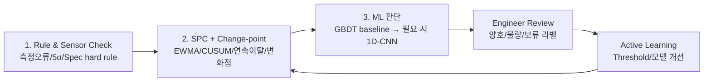
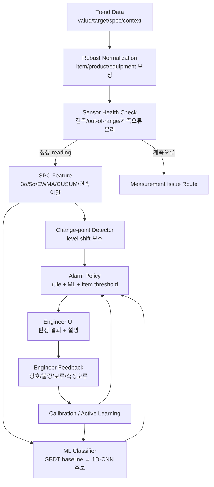
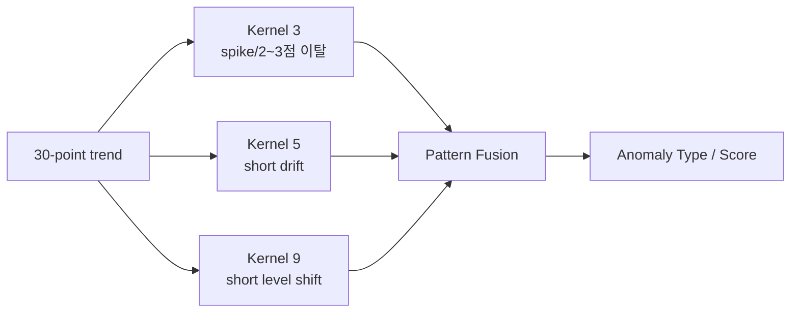
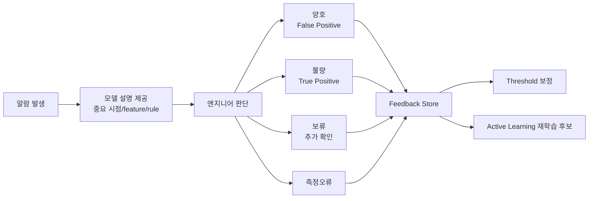
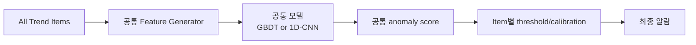
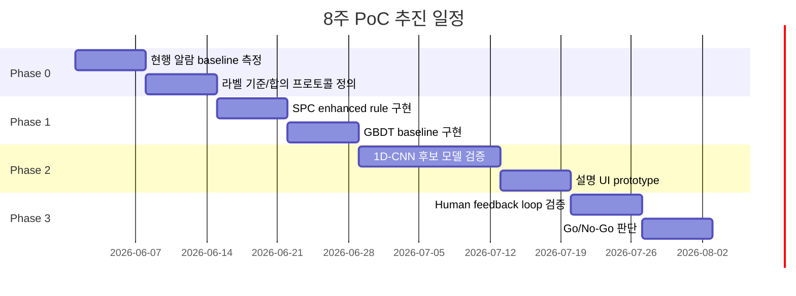

# 반도체 공정 Trend 이상 감지 고도화 제안서 v2

> Claude Review v1의 지적을 반영해, 기존 제안의 방향성은 유지하되 **임원/리더가 빠르게 판단할 수 있도록 단순화한 배포용 제안서**입니다.  
> 핵심 메시지는 “1D-CNN 도입”이 아니라, **불필요 알람을 줄이고 조치 가능한 이상을 설명과 함께 우선순위화하는 운영 체계 전환**입니다.

---

## 1. 한 장 요약

### 결론

현행 3σ 기반 알람은 단일 포인트 이탈에는 유효하지만, 실제 엔지니어가 보는 **연속 이탈, 점진 drift, level shift, 상/하한 비대칭, 측정 오류**를 충분히 반영하지 못합니다.  
따라서 본 과제는 단순 모델 교체가 아니라, 아래 3단 구조로 모니터링 체계를 고도화하는 것이 핵심입니다.



### 핵심 방향

| 항목 | 기존 접근 | 제안 접근 |
|---|---|---|
| 알람 기준 | target ± 3σ | Rule + SPC + Change-point + ML score |
| 모델 전략 | 복잡한 RNN/딥러닝 우선 | GBDT baseline을 먼저 검증하고, 1D-CNN은 추가 효과가 있을 때 채택 |
| 라벨링 | 엔지니어 개별 판단 | 다수 엔지니어 합의 label + 피드백 축적 |
| 운영 단위 | item별 rule 수작업 | 공통 모델 + item별 threshold/calibration |
| 설명 방식 | 알람 여부 중심 | 어떤 시점/feature/rule 때문에 알람인지 표시 |

---

## 2. 왜 지금 바꿔야 하는가

### 현재 문제

- 관리해야 할 trend item이 많아져 엔지니어 육안 판정 부담 증가
- 3σ 단일 기준은 단발 spike를 과하게 잡아 false positive가 많음
- 실제 이상 판단은 단순 이탈이 아니라 pattern 기반임
  - 2~3포인트 이상 연속 이탈
  - 완만한 상승/하락 drift
  - 평균 level shift
  - 상한/하한 방향별 위험도 차이
  - 측정 오류와 실제 공정 이상 구분
- 엔지니어별 판단 기준이 달라 label 자체가 흔들릴 수 있음

### 핵심 진단

> 문제의 본질은 “알람 threshold를 몇 σ로 잡을 것인가”가 아니라,  
> **엔지니어가 눈으로 보던 trend 판정 기준을 시스템 안에 구조화하지 못한 것**입니다.

---

## 3. 제안 구조

### 3.1 전체 Architecture



### 3.2 핵심 설계 원칙

| 원칙 | 의미 |
|---|---|
| Rule은 버리지 않는다 | 5σ, spec hard violation, sensor error는 rule이 더 안전함 |
| ML은 pattern 판단에 쓴다 | spike 복귀, drift, persistent high/low 같은 shape 구분에 사용 |
| 1D-CNN은 검증 후 채택한다 | GBDT baseline 대비 추가 효과가 없으면 쓰지 않음 |
| Measurement error는 별도 라우팅한다 | 공정 이상 class로 학습시키지 않고 sensor health layer에서 분리 |
| 엔지니어 feedback은 운영 자산이다 | reject/accept 라벨을 threshold와 모델 개선에 사용 |

---

## 4. 왜 1D-CNN을 검토하는가

1D-CNN은 최근 30포인트 trend의 **시간축 pattern**을 직접 학습할 수 있습니다.



다만 이번 제안에서 1D-CNN은 “무조건 도입할 모델”이 아닙니다.  
먼저 아래 baseline과 비교합니다.

| 후보 | 역할 |
|---|---|
| 3σ rule | 현행 baseline |
| SPC enhanced rule | EWMA, CUSUM, 연속 이탈 rule 반영 |
| GBDT baseline | slope, EWMA, upper/lower score 등 tabular feature 기반 |
| 1D-CNN | GBDT가 놓치는 waveform shape와 channel 간 동시발생 pattern 학습 |

### 채택 기준

> 1D-CNN은 **GBDT baseline 대비 event-based F1, false positive, detection delay에서 의미 있는 개선이 있을 때만** 운영 후보로 채택합니다.

이 기준을 명확히 두면, “딥러닝을 쓰기 위한 과제”가 아니라 “운영 성능이 검증된 방법을 선택하는 과제”가 됩니다.

---

## 5. Human-in-the-loop 운영

모델이 모든 판단을 자동으로 대체하는 것이 아니라, 엔지니어 검토 결과를 학습 자산으로 축적하는 구조입니다.



### 라벨링 항목

| 항목 | 설명 |
|---|---|
| `review_result` | 양호 / 불량 / 보류 / 측정오류 |
| `action_required` | 실제 조치 필요 여부 |
| `correct_anomaly_type` | 모델 유형 분류가 틀린 경우 수정 |
| `severity` | Warning / Alarm / Critical |
| `comment` | 엔지니어 판단 근거 |

### Active Learning 대상

모든 알람을 다 라벨링하면 다시 피로도가 생깁니다. 따라서 아래 샘플을 우선 검토합니다.

| 우선 대상 | 이유 |
|---|---|
| 모델 확신도가 낮은 건 | 경계 사례를 학습해 성능 개선 가능 |
| Rule과 ML 판단이 다른 건 | 기준 불일치 개선 가능 |
| 같은 item에서 반복 reject되는 건 | item별 threshold 보정 필요 |
| critical item 관련 건 | miss 비용이 큼 |
| 기존에 없던 pattern | 신규 이상 유형 조기 포착 |

---

## 6. item별 모델 난립을 피하는 운영 전략

사용자 우려처럼, 관리 trend item마다 모델을 따로 만들면 운영이 급격히 복잡해집니다.

### item별 개별 모델의 문제

| 문제 | 영향 |
|---|---|
| 모델 수 폭증 | 배포, 성능관리, 재학습, rollback 부담 증가 |
| label 부족 | item별 불량 label이 적어 과적합 위험 |
| 신규 item cold-start | 라벨이 없으면 모델 생성 불가 |
| 기준 불일치 | item마다 다른 모델이 서로 다른 기준을 학습 |

### 제안 원칙

> **공통 모델 backbone + item별 calibration**을 기본 구조로 사용합니다.



| 구분 | 운영 방식 |
|---|---|
| 일반 item | 공통 모델 + item별 threshold |
| 신규 item | target/spec 기반 보수적 threshold로 cold-start |
| 반복 FP item | threshold, persistence rule, suppression 조건 보정 |
| critical item | hard rule 강화, 필요 시 specialist head 예외 검토 |

즉, feedback은 item별 모델을 무한히 만드는 데 쓰지 않고, **공통 모델 개선과 item별 threshold 보정**에 우선 사용합니다.

---

## 7. PoC 추진안

### 7.1 PoC 목적

PoC의 목적은 “최고 성능 모델을 만드는 것”이 아니라, 다음 의사결정을 가능하게 하는 것입니다.

1. 현행 3σ baseline의 false positive와 miss 수준을 정량화한다.
2. SPC enhanced rule만으로 충분한지 확인한다.
3. GBDT baseline 대비 1D-CNN의 추가 효과가 있는지 검증한다.
4. 엔지니어 feedback을 threshold 개선에 연결할 수 있는지 확인한다.
5. 실데이터에서도 합성 데이터와 유사한 pattern 구분이 가능한지 확인한다.

### 7.2 단계별 계획



### 7.3 평가 지표

| KPI | 의미 | 판단 기준 |
|---|---|---|
| False positive / item / week | 엔지니어 reject 알람 수 | 기존 대비 유의미 감소 |
| Event-based recall | 실제 이상 event를 놓치지 않았는가 | 기존 rule 이하로 악화 금지 |
| Detection delay | 이상 시작 후 몇 point 뒤 알람인가 | drift에서 단축되면 효과 있음 |
| Action-worthy precision | 실제 조치 필요 알람 비율 | 현행 대비 개선 |
| Engineer accept rate | 엔지니어가 알람을 받아들인 비율 | feedback 기반 개선 여부 확인 |
| Inter-annotator agreement | 엔지니어 라벨 일관성 | 낮으면 taxonomy부터 재정의 |

> 합성 데이터 성능은 algorithm sanity check 용도이며, 임원 보고용 KPI는 반드시 실데이터 기반으로 산정합니다.

---

## 8. 리스크와 대응

| 리스크 | 대응 |
|---|---|
| 엔지니어 라벨이 서로 다름 | 다수 엔지니어 독립 라벨 후 합의 label 생성, agreement 측정 |
| 1D-CNN 효과가 작음 | GBDT baseline이 충분하면 더 단순한 모델 채택 |
| false negative 발생 | hard rule layer 유지, critical item threshold 보수화 |
| false positive 재발 | feedback 기반 item별 threshold/suppression 보정 |
| measurement error 혼입 | sensor health layer에서 별도 분리 |
| item별 모델 난립 | 공통 모델 + item별 calibration 원칙 유지 |
| 시간에 따른 공정 drift | 주기적 champion-challenger 평가와 drift monitoring |
| 설명 불신 | attention 단독이 아니라 rule trigger, feature 기여도, change-point 근거 함께 제공 |

---

## 9. 의사결정 요청

### 요청 1. PoC 승인

- 기간: 8주
- 범위: 합성 데이터 sanity check + 제한된 실데이터 sample 검증
- 산출물: baseline 측정표, SPC/GBDT/1D-CNN 비교 결과, 설명 UI mock, feedback schema

### 요청 2. 엔지니어 라벨링 리소스 확보

- 최소 2~3명의 experienced engineer 참여
- 동일 sample 일부를 중복 라벨링하여 기준 일관성 확인
- disagreement sample은 합의 회의로 label 기준 정리

### 요청 3. Go/No-Go 기준 합의

1D-CNN 채택 여부는 사전에 정한 기준으로 판단합니다.

```text
1. 3σ/SPC 대비 false positive가 감소하는가?
2. critical miss가 증가하지 않는가?
3. GBDT 대비 1D-CNN의 추가 효과가 있는가?
4. 엔지니어가 설명을 보고 알람을 신뢰할 수 있는가?
5. item별 모델 없이 공통 모델 + calibration으로 운영 가능한가?
```

---

## 10. 최종 메시지

본 과제는 “AI 모델을 하나 만드는 일”이 아닙니다.  
엔지니어가 눈으로 하던 trend 판정을 **Rule, SPC, ML, Feedback**으로 구조화하여 운영 가능한 의사결정 시스템으로 바꾸는 과제입니다.

> 최종 목표는 알람을 많이 내는 것이 아니라,  
> **불필요 알람은 줄이고, 조치가 필요한 이상은 설명과 함께 빠르게 보여주는 것**입니다.

---

## References

- NIST/Sematech Engineering Statistics Handbook, EWMA/CUSUM Control Charts.
- Ismail Fawaz et al. (2019), InceptionTime: Finding AlexNet for Time Series Classification.
- Dempster et al. (2020), MiniROCKET: A Very Fast Almost Deterministic Transform for Time Series Classification.
- Jain & Wallace (2019), Attention is not Explanation.
- Settles (2009), Active Learning Literature Survey.
- Tatbul et al. (2018), Precision and Recall for Time Series.
